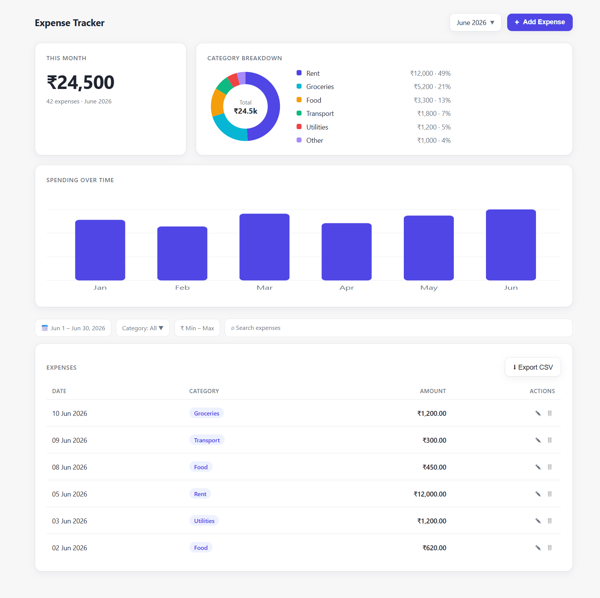
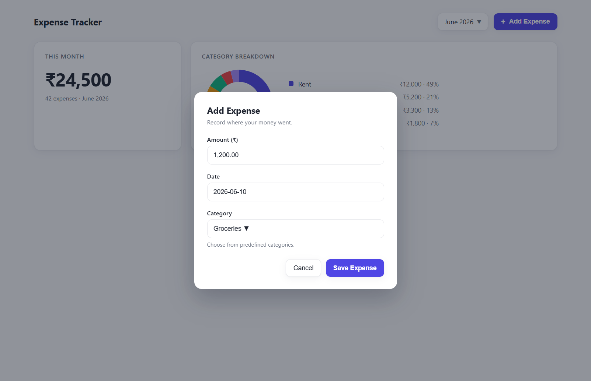
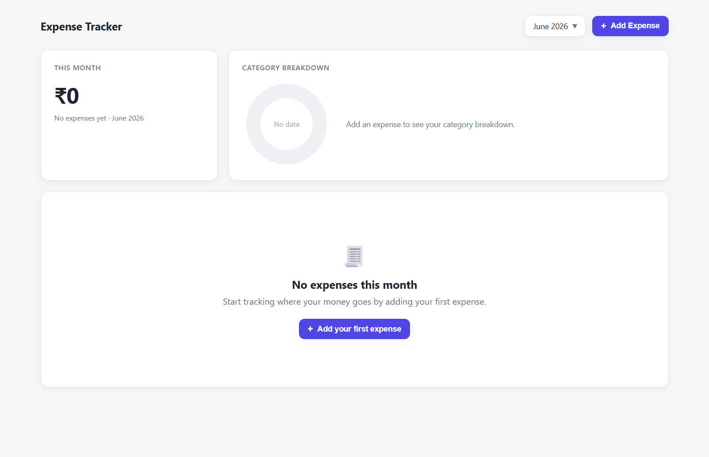
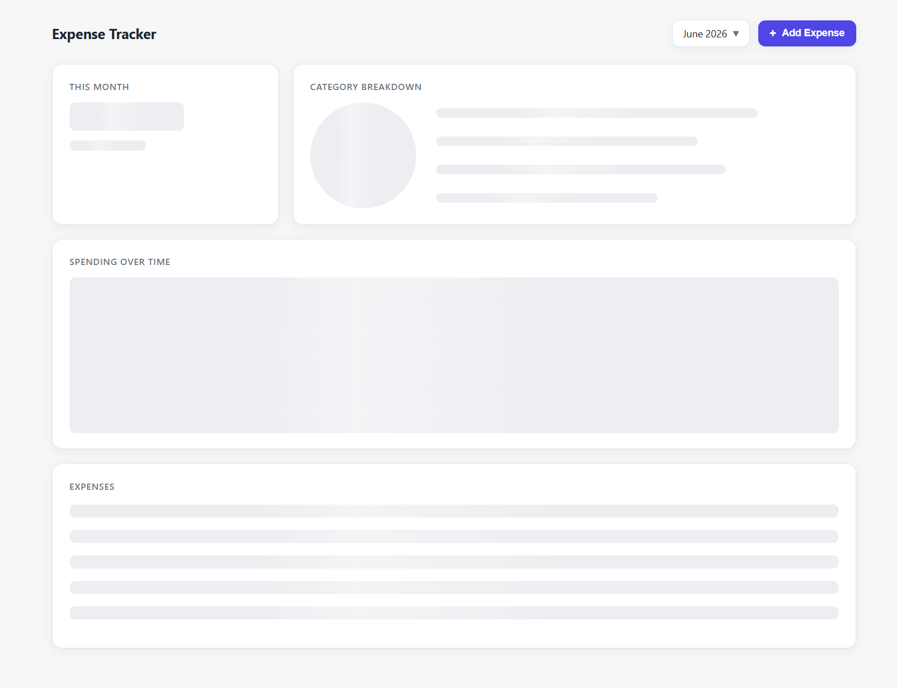

# Expense Tracker — Wireframes

_Last updated: 2026-06-10_

These wireframes are **rendered HTML/CSS mockups** captured via Chrome
DevTools, not hand-drawn sketches. The source mockups live in `wireframes/`
(`dashboard.html`, `modal.html`, `empty.html`, `loading.html`, `styles.css`)
and the captured images in `wireframes/screenshots/`. Viewport: **desktop
(1280px wide)**.

They reflect the agreed design: a clean, minimal **single-page** layout,
current-month focus, **total + category donut** emphasis, and an **add/edit
modal**.

---

## 1. Main Dashboard

The single scrollable page: header (title, month selector, **+ Add Expense**),
summary row (this-month total + category donut with legend), spending-over-time
trend, filter bar, and the expense table with **Export CSV**.

**Regions**
- **Header** — app title, month selector (defaults to current month), primary Add button.
- **This Month card** — large total (₹24,500) + count/period subtext.
- **Category Breakdown card** — donut + legend with amount and percent per category.
- **Spending Over Time** — bar chart across recent months.
- **Filter bar** — date range, category, amount range, search.
- **Expenses table** — date, category pill, right-aligned amount, edit/delete actions.

---

## 2. Add / Edit Expense — Modal

Clicking **+ Add** (or a row's edit icon) opens a centered modal over a dimmed
dashboard. Fields: **Amount (₹)**, **Date** (defaults to today), **Category**
(predefined dropdown). Actions: **Cancel** / **Save Expense**. Edit mode
pre-fills the same form.

**Notes**
- Required fields validated inline; amount must be > 0.
- On save, the modal closes and the dashboard + list refresh.

---

## 3. Empty State

Shown when the selected month has no expenses: total reads ₹0, the donut shows a
"No data" ring, and the list area becomes a friendly prompt with a primary
**Add your first expense** call-to-action.

---

## 4. Loading State

While the API responds, the layout is preserved with **skeleton placeholders**
for the total, donut, legend, trend chart, and table rows (via TanStack Query
loading states).

---

## Reproducing the Screenshots

1. Open any mockup file under `wireframes/` in a browser, e.g.
   `wireframes/dashboard.html` (no server or network needed — pure HTML/CSS).
2. Or re-capture via Chrome DevTools at a 1280px-wide viewport, saving to
   `wireframes/screenshots/`.

> These are **design wireframes** for alignment, not the production frontend.
> The real UI will be built with React + Tailwind + Recharts per
> `technical-architecture.md`.
